<p align="center">
  
</p>

<p align="center">
  <a href="README.md">English</a> ·
  <a href="https://sunwood-ai-labs.github.io/codex-remote-control-lab/ja/">Docs</a> ·
  <a href="https://github.com/Sunwood-ai-labs/codex-remote-control-lab">GitHub</a>
</p>

<p align="center">
  
  
  
  
</p>

# Codex Remote Control Lab

Codex Remote Control Lab は、デスクトップで動いている Codex セッションをスマホから操作できるようにする実験 repo です。Mac で bridge を起動し、スマホで token 付き URL を開けば、同じ Codex thread を PC とスマホのどちらからでも継続できます。

OpenAI Codex CLI の `remote-control` / `app-server` をローカル優先で扱います。Codex app-server は `127.0.0.1` に閉じ、同じ LAN 上の端末へは token 付きの小さな browser bridge だけを公開します。

## ✨ できること

- repo-local の Codex CLI `0.130.0` app-server を起動
- スマホの browser からデスクトップ側の Codex app-server を操作
- PC とスマホで 1 つの Codex thread を同期し、PC で始めた作業をスマホからそのまま続行
- スマホ向け browser UI で thread resume、artifact preview、承認、model 選択、画像添付、カラーテーマ切替を扱う
- phone と desktop browser で 1 つの bridge-managed Codex thread を共有
- `.phone-token`、`.uploads/`、`.codex-home*/`、log、session database を Git に入れない
- VitePress と GitHub Pages で日英 docs を公開

## 🚀 Quick Start

```bash
git clone https://github.com/Sunwood-ai-labs/codex-remote-control-lab.git
cd codex-remote-control-lab
npm ci
npm run phone
```

次のような URL が表示されます。

```text
http://192.168.11.8:45214/?token=...
```

同じ Wi-Fi/LAN 上のスマホで、その URL をそのまま開きます。

繰り返し使う local 設定は、example をコピーして編集できます。

```bash
cp .env.example .env
```

token なしで UI をローカルデバッグする場合は、次を使います。

```bash
PHONE_DEBUG_NO_TOKEN=1 npm run phone
```

local `.env` に `PHONE_DEBUG_NO_TOKEN=1` を置いても、同じ localhost 専用 mode になります。

このデバッグモードでは bridge を `127.0.0.1` に bind し、`?token=...` なしの URL を表示します。LAN、tunnel、shared network では使わないでください。

信頼できる LAN 上の別端末から token なしで触りたい場合だけ、`PHONE_DEBUG_NO_TOKEN=1` と一緒に `PHONE_DEBUG_BIND=lan` を置きます。この場合は bridge を `0.0.0.0` に bind し、token なし LAN URL を表示します。自分が管理する private network でだけ使ってください。

## 🧭 構成

```text
phone browser -> http://Mac-LAN-IP:45214 -> Node bridge -> ws://127.0.0.1:45213 -> Codex app-server
```

安全境界は意図的です。Codex app-server は localhost に残し、LAN に出るのは token-protected bridge だけです。

## 🧪 検証コマンド

```bash
npm run check
npm run docs:build
npm audit --omit=dev
```

protocol だけを smoke test する場合:

```bash
npm run server:ws
npm run probe:ws
```

local smoke test では、WebSocket app-server 経由の `initialize` / `thread/start` と、`/readyz` / `/healthz` の挙動を確認しています。

## 📱 Phone Bridge

この bridge の一番大きな価値は、デスクトップ上の Codex をスマホから操作できることです。Codex 本体は Mac の localhost に置いたまま、スマホは LAN 経由のリモコンとして動きます。同じ bridge-managed thread を PC browser と phone browser の両方で開けるため、作業セッションが端末ごとに分断されず、PC とスマホで同期した感覚で続けられます。

便利な環境変数:

```text
PHONE_UI_PORT=45214
CODEX_WORKDIR=/Users/admin/Prj/some-project
CODEX_MODEL=gpt-5.4
CODEX_APP_SERVER_SOCK=/Users/admin/.codex/app-server-control/app-server-control.sock
CODEX_APP_SERVER_URL=ws://127.0.0.1:45213
CODEX_HISTORY_SYNC=1
PHONE_TOKEN=choose-your-own-token
PHONE_DEBUG_NO_TOKEN=1
PHONE_DEBUG_BIND=lan
PHONE_NTFY_TOPIC=your-private-topic
PHONE_PUSHOVER_TOKEN=app-token
PHONE_PUSHOVER_USER=user-key
PHONE_DISCORD_WEBHOOK_URL=https://discord.com/api/webhooks/...
PHONE_NOTIFY_TIMEOUT_MS=5000
```

公開安全な template は [.env.example](.env.example) にあります。

`CODEX_APP_SERVER_SOCK` または `CODEX_APP_SERVER_URL` を指定すると、bridge は新しい app-server を起動せず、既存の headless app-server に接続します。Codex Desktop 本体とライブ同期したい場合は、Desktop の通常ローカル会話画面ではなく、Desktop の Remote Connection と OCdex を同じ headless app-server に接続してください。Desktop の通常ローカル会話画面は専用の `stdio` app-server を使うため、外部 bridge からその画面へ直接ライブ注入する公開経路はありません。

履歴同期は既定で有効です。Web 側の turn 完了後、bridge は `thread/read` と scan-backed な `thread/list` を実行して app-server の履歴/index を温めます。`/api/threads` も state DB 限定ではなく scan-and-repair で取得します。これにより Codex Desktop 側で thread を開き直す/再読込したときに、更新済み session を見つけやすくします。ただし、通常の Desktop 会話画面へライブ注入するものではありません。追加の履歴 refresh を止めたい場合は `CODEX_HISTORY_SYNC=0` を指定します。

起動通知は opt-in です。`PHONE_NTFY_TOPIC` がある場合は ntfy topic へ、`PHONE_PUSHOVER_TOKEN` と `PHONE_PUSHOVER_USER` がある場合は Pushover へ、`PHONE_DISCORD_WEBHOOK_URL` がある場合は Discord へ bridge URL を送ります。`npm run phone` は local `.env` を読んでから環境変数を参照します。`PHONE_NTFY_SERVER` は既定で `https://ntfy.sh`、HTTPS 必須です。通知本文には token 付き URL が入るので、private/protected topic、account、channel を使い、値は local environment variables に置いてください。

現在の bridge は次をサポートします。

- Codex Desktop 風の sidebar / conversation / artifact panel / composer layout
- 最近の thread 一覧と直接 resume
- Desktop の開き直し/再読込に寄せた既定の履歴同期 refresh
- plugin、model、config/auth、automation status panel
- 次 turn 向けの approval / sandbox mode control
- chat と artifact preview の Markdown rendering
- Markdown image link の inline rendering
- browser で選んだ画像を Codex `localImage` input として送信
- local repository image artifact を token-protected file route から表示
- status/tool log の折りたたみ表示
- simple / cyberpunk / botanical / Stigmata のカラーテーマを browser local storage に保存

## 🖼️ UI Evidence

Desktop-like layout:

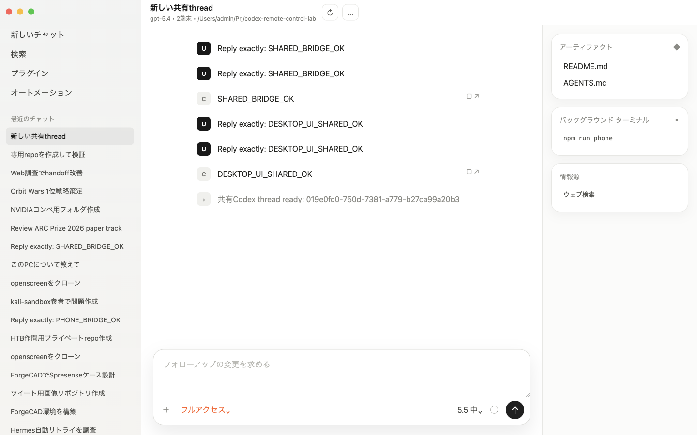

Compact chat typography with image-link preview:

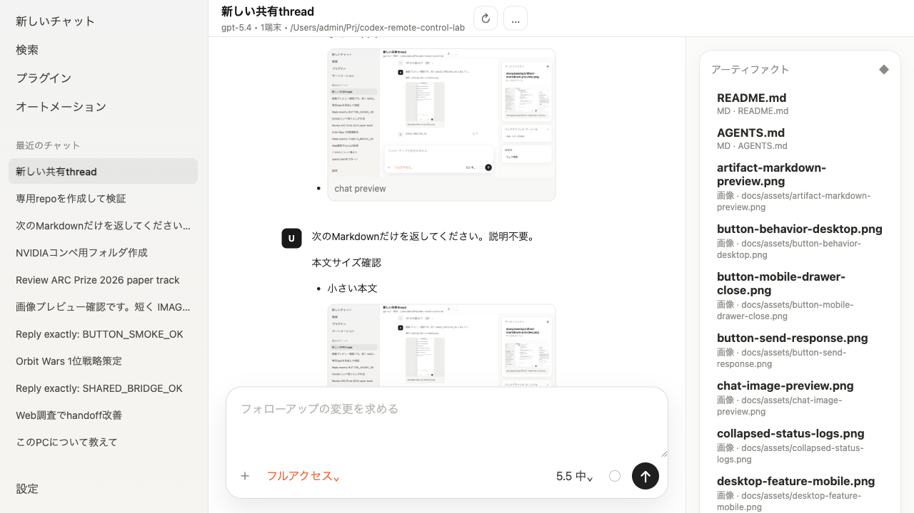

Theme comparison:

<table>
  <tr>
    <td align="center" width="25%">
      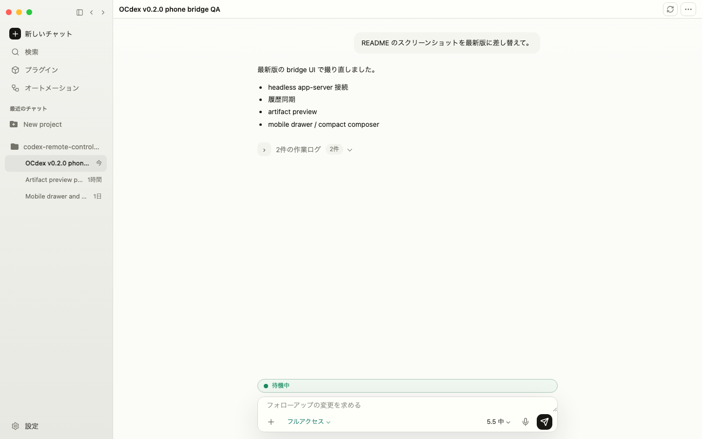<br>
      <sub>シンプル desktop</sub>
    </td>
    <td align="center" width="25%">
      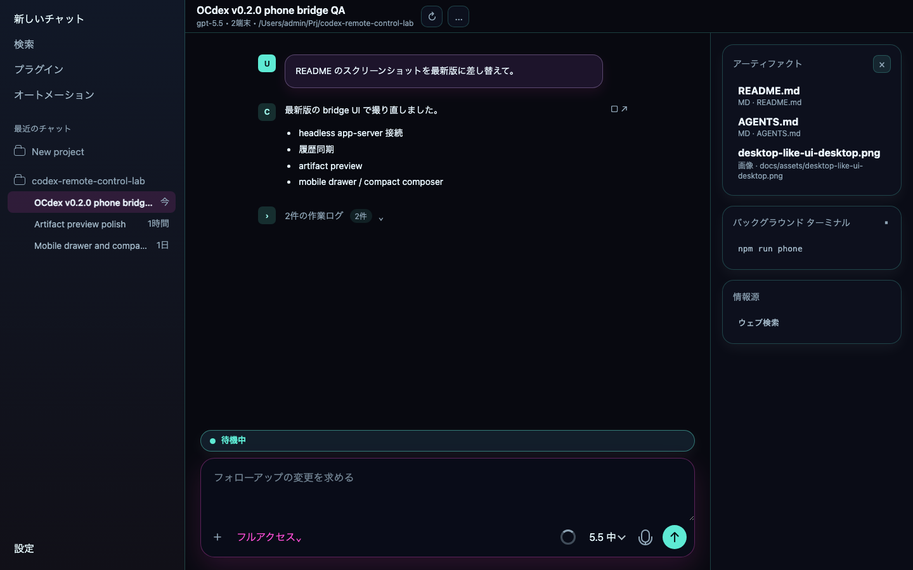<br>
      <sub>サイバーパンク desktop</sub>
    </td>
    <td align="center" width="25%">
      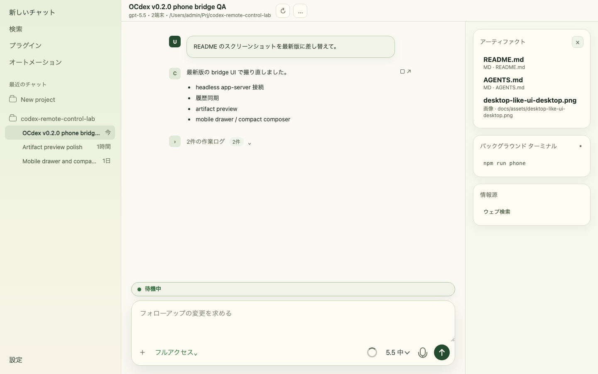<br>
      <sub>ボタニカル desktop</sub>
    </td>
    <td align="center" width="25%">
      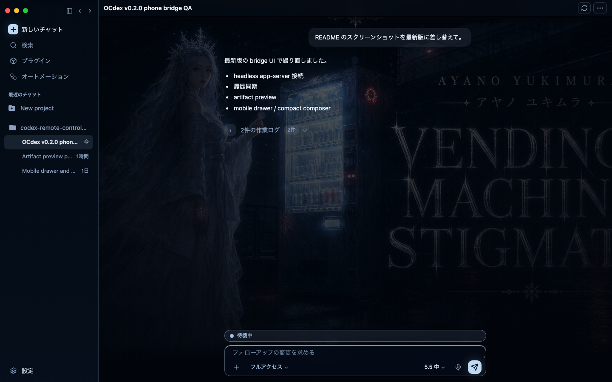<br>
      <sub>Stigmata desktop</sub>
    </td>
  </tr>
  <tr>
    <td align="center" width="25%">
      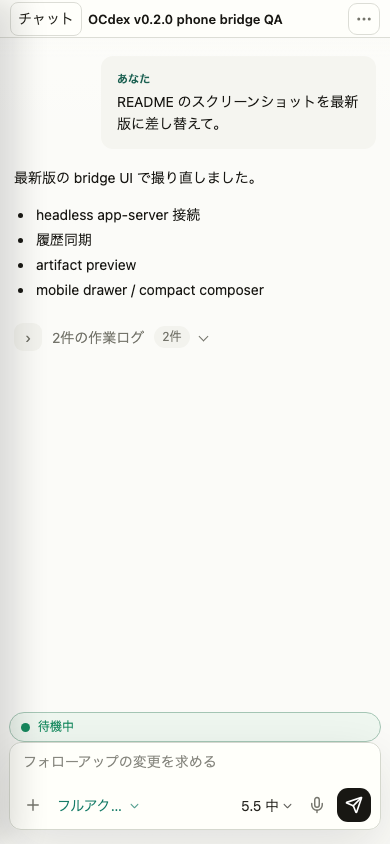<br>
      <sub>シンプル設定</sub>
    </td>
    <td align="center" width="25%">
      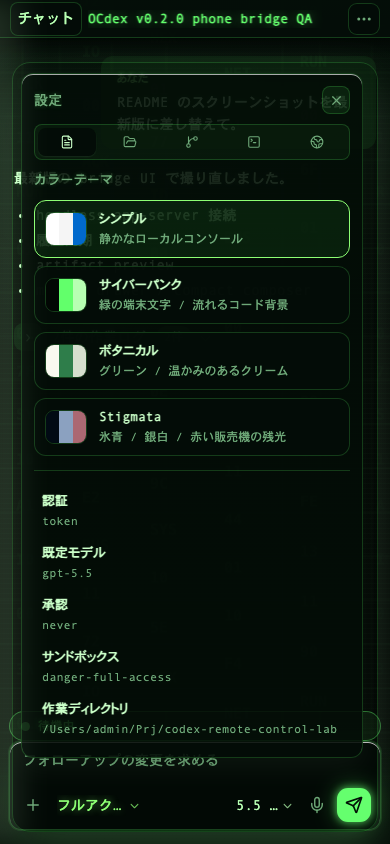<br>
      <sub>サイバーパンク設定</sub>
    </td>
    <td align="center" width="25%">
      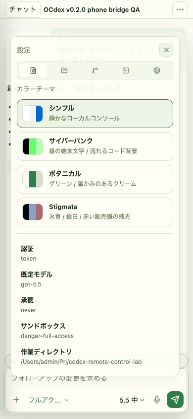<br>
      <sub>ボタニカル設定</sub>
    </td>
    <td align="center" width="25%">
      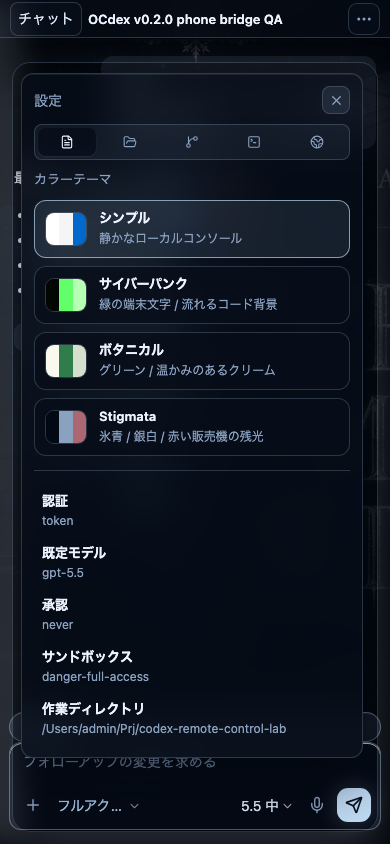<br>
      <sub>Stigmata設定</sub>
    </td>
  </tr>
</table>

Mobile flow:

<table>
  <tr>
    <td align="center" width="33%">
      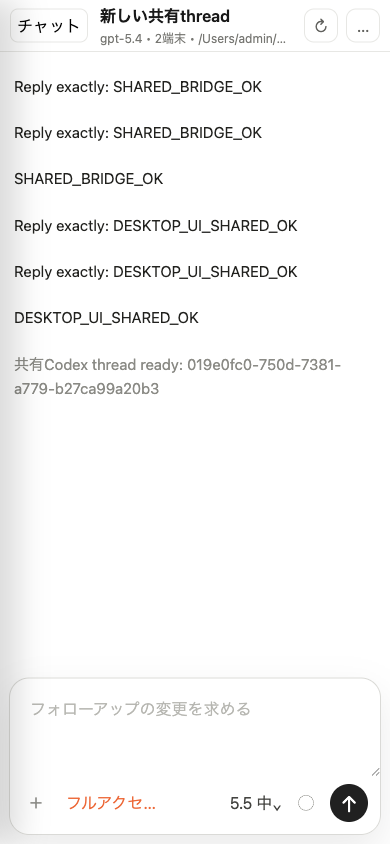<br>
      <sub>モバイル全体</sub>
    </td>
    <td align="center" width="33%">
      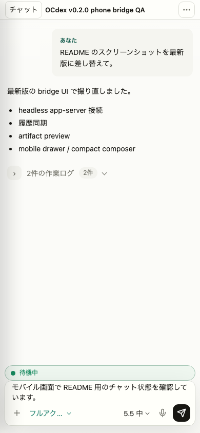<br>
      <sub>チャット表示</sub>
    </td>
    <td align="center" width="33%">
      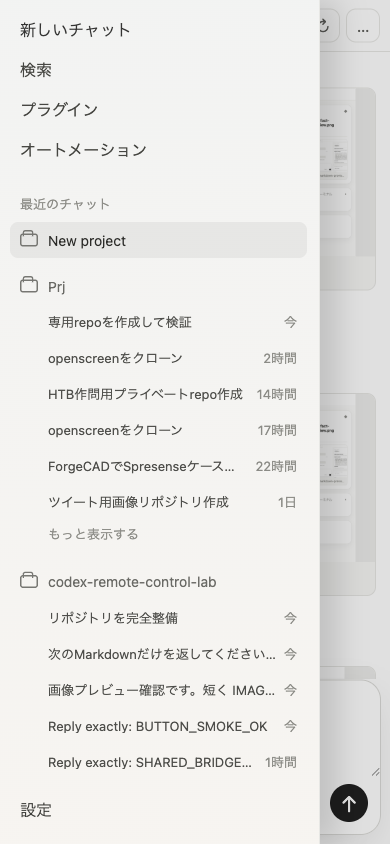<br>
      <sub>スレッド drawer</sub>
    </td>
  </tr>
  <tr>
    <td align="center" width="33%">
      <br>
      <sub>テーマ設定</sub>
    </td>
    <td align="center" width="33%">
      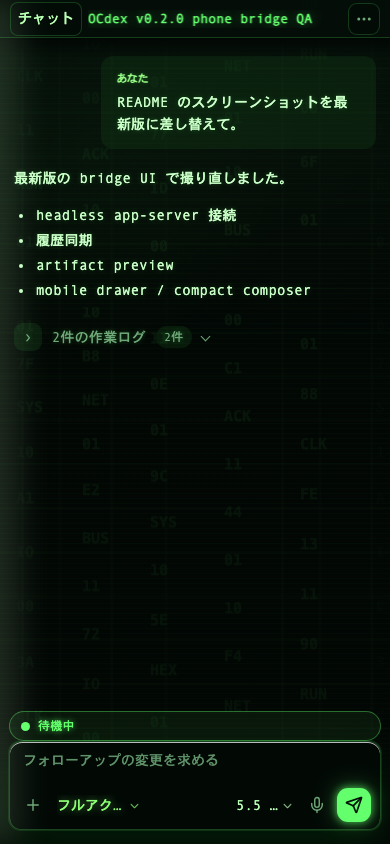<br>
      <sub>composer 操作</sub>
    </td>
    <td align="center" width="33%">
      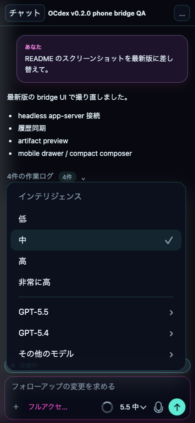<br>
      <sub>モデル menu</sub>
    </td>
  </tr>
</table>

追加スクリーンショットは `docs/assets/` と bridge UI の artifact panel から確認できます。

## 🔐 Safety Notes

- Codex app-server は `127.0.0.1` に保ちます。
- 認証なしの Codex app-server を LAN や public interface に直接 bind しないでください。
- 表示された `?token=...` 付き URL は local access key として扱い、公開 issue、共有チャット、スクリーンショット、配信には載せないでください。
- `PHONE_DEBUG_NO_TOKEN=1` は localhost デバッグ用です。信頼できる private LAN に token なしで出す場合だけ `PHONE_DEBUG_BIND=lan` を一緒に使ってください。
- bridge は `Ctrl+C` で停止します。terminal を閉じた場合や PC を再起動した後は、もう一度 `npm run phone` を実行します。
- trusted LAN 外から使う場合は SSH forwarding、VPN、mesh network を優先してください。
- 認証なしの public tunnel や raw port forwarding で bridge を公開しないでください。
- shared network で demo した後は `.phone-token` を削除するか `PHONE_TOKEN` を変更してください。

公開安全 checklist は [SECURITY.md](SECURITY.md) にあります。

## 📚 Documentation

- [English docs](https://sunwood-ai-labs.github.io/codex-remote-control-lab/)
- [日本語ドキュメント](https://sunwood-ai-labs.github.io/codex-remote-control-lab/ja/)
- [v0.2.0 リリースノート](https://sunwood-ai-labs.github.io/codex-remote-control-lab/ja/guide/releases/v0.2.0)
- [Phone bridge guide](docs/ja/guide/phone-bridge.md)
- [Protocol notes](docs/ja/guide/protocol.md)
- [Security model](docs/ja/guide/security.md)

## 🗂️ Repository Layout

```text
public/              Phone bridge が配信する browser UI
scripts/             Codex app-server probe と bridge launcher
docs/                VitePress docs と screenshot assets
docs/assets/         UI verification screenshots
docs/public/         docs/README 用 identity assets
.github/workflows/   CI と GitHub Pages deployment
```

## 📄 License

ISC. See [LICENSE](LICENSE).
