# Codex Remote Control Lab

This repository is a small, isolated lab for OpenAI Codex CLI `0.130.0`.

## What Was Verified

- The globally active Codex CLI on this Mac is still `0.128.0`.
- `@openai/codex@0.130.0` is installed locally in this repository, so experiments do not replace the user's main CLI.
- `codex --help` in `0.130.0` includes the new `remote-control` command.
- `codex remote-control --help` describes it as an experimental headless app-server entrypoint.
- `codex remote-control` starts a foreground app-server with local transports disabled. It does not open a TCP listener by itself.
- `codex app-server --listen ws://127.0.0.1:45213` starts a localhost WebSocket server and exposes `/readyz` and `/healthz`.
- A minimal WebSocket client can perform `initialize` and `thread/start`, creating a thread under the isolated `CODEX_HOME`.

## Commands

Use the repository-local Codex binary:

```bash
cd /Users/admin/Prj/codex-remote-control-lab
export PATH="$PWD/node_modules/.bin:$PATH"
```

Check the installed version and the new command:

```bash
npm run version:codex
npm run help:remote-control
```

Try `remote-control` without touching the global Codex home:

```bash
mkdir -p .codex-home-remote
CODEX_HOME="$PWD/.codex-home-remote" codex remote-control
```

Run the experimental WebSocket app-server:

```bash
npm run server:ws
```

In another terminal:

```bash
curl -i http://127.0.0.1:45213/readyz
curl -i http://127.0.0.1:45213/healthz
npm run probe:ws
```

## Use From A Phone On The Local Network

Start the phone bridge on the Mac:

```bash
cd /Users/admin/Prj/codex-remote-control-lab
npm run phone
```

The command prints a phone URL like:

```text
http://192.168.11.8:45214/?token=...
```

Open that exact URL from a phone connected to the same Wi-Fi/LAN.

The bridge uses this safer layout:

```text
phone browser -> http://Mac-LAN-IP:45214 -> Node bridge -> ws://127.0.0.1:45213 -> Codex app-server
```

So Codex's app-server remains bound to `127.0.0.1`; only the small phone UI is reachable from the LAN. A random token is stored in `.phone-token` and required by both the page URL and WebSocket bridge.

Useful environment variables:

```bash
PHONE_UI_PORT=45214 npm run phone
CODEX_WORKDIR=/Users/admin/Prj/some-project npm run phone
CODEX_MODEL=gpt-5.4 npm run phone
PHONE_TOKEN=choose-your-own-token npm run phone
```

The current phone bridge supports:

- a Codex Desktop-like browser layout with a left thread sidebar, central conversation, right artifact panel, and bottom composer
- starting a Codex thread
- sharing the same bridge thread across multiple browsers, such as a PC browser and a phone browser
- listing recent existing Codex threads from `~/.codex` and resuming one from the browser UI
- searching/filtering the visible recent thread list
- reading installed plugin data from `plugin/list`
- reading model data from `model/list` and applying the selected model to the next turn
- reading configuration/auth status from `config/read` and `getAuthStatus`
- listing local Codex automation definitions from `~/.codex/automations`
- switching approval/sandbox mode for the next turn through `turn/start`
- previewing repository files in the artifact panel
- rendering Markdown artifacts, such as `README.md`, as previews in the artifact panel
- attaching browser-selected images by saving them locally and sending them as `localImage` inputs
- previewing attached images in the composer and chat transcript
- rendering Markdown image links directly in the chat transcript where possible
- previewing image artifacts from `docs/assets` in the artifact panel
- rendering user and assistant chat messages as Markdown previews instead of plain text
- keeping chat Markdown typography on one compact size scale so lists do not become visually louder than paragraphs
- collapsing consecutive status/tool logs into summary rows that can be expanded on demand
- sending prompts from the phone
- streaming assistant text back to the phone
- showing command/file-change approval requests with approve/decline buttons
- scrolling long resumed threads inside the conversation pane while keeping the composer visible

Open the same printed URL from both the Mac/PC browser and the phone to see the same shared bridge thread. To resume a known existing thread directly, add `thread=<thread_id>`:

```text
http://192.168.11.8:45214/?token=...&thread=019e...
```

This is not a pixel-for-pixel mirror of the Codex Desktop app. It is a browser client that uses the same Codex app-server protocol and the same default `~/.codex` session store, so existing threads can be listed/resumed and multiple browser clients can share one bridge-managed thread.

The bridge was smoke-tested locally by sending `Reply exactly: PHONE_BRIDGE_OK` through the phone WebSocket path and receiving `PHONE_BRIDGE_OK`.

The expanded desktop-style controls were smoke-tested by pressing the visible browser UI buttons for search, plugins, automations, settings, model selection, access mode, background status, web-search prompt insertion, artifact preview, and send. The send check used `Reply exactly: BUTTON_SMOKE_OK` and received `BUTTON_SMOKE_OK`.

Markdown rendering was smoke-tested through the browser composer with a heading, bullet list, inline code, link, and fenced code block. Both the user message and assistant response rendered as previews.

## UI Verification Screenshots

Desktop-like layout:


Mobile layout:


Responsive checkpoints:

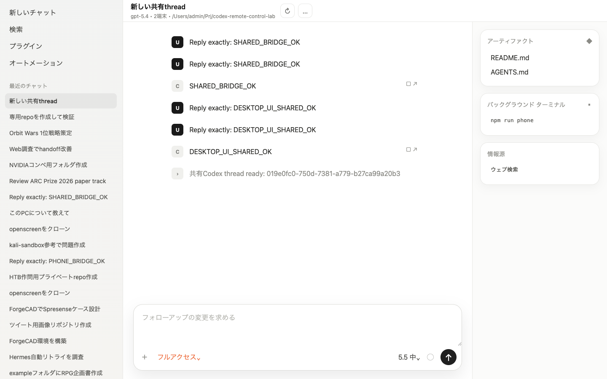

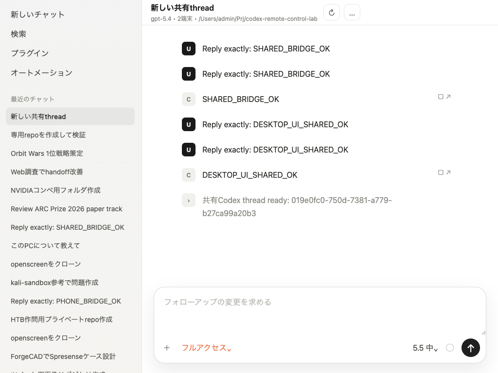

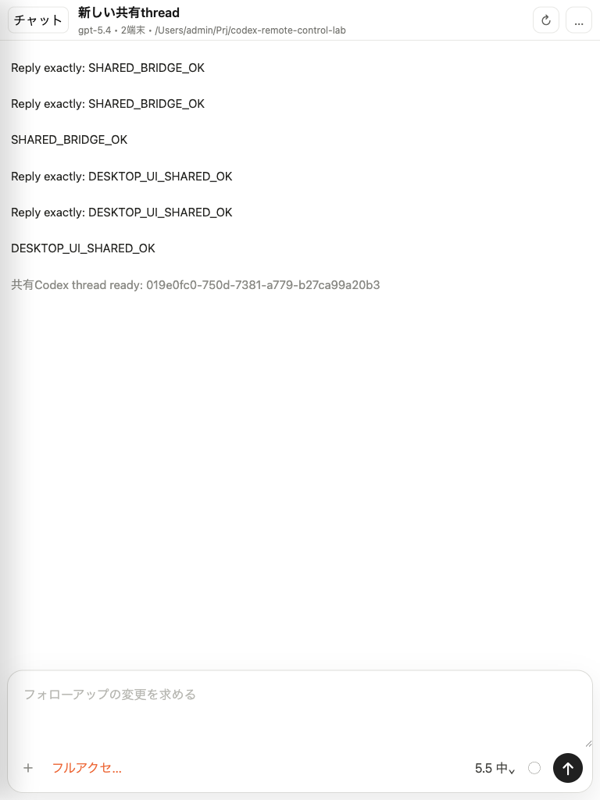

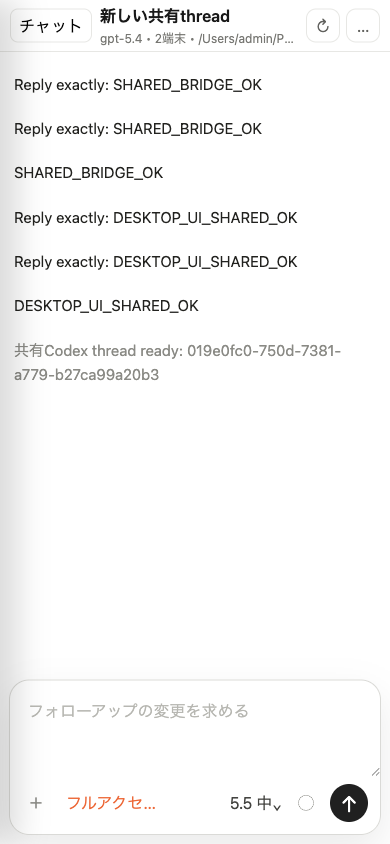

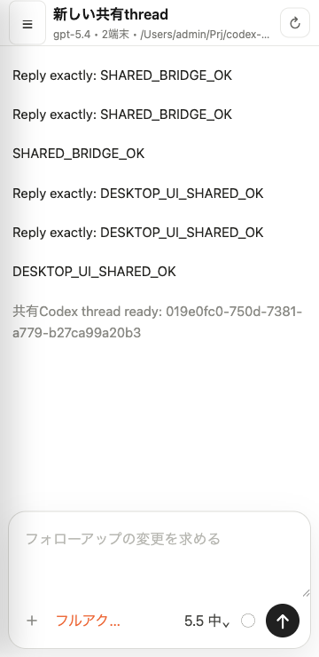

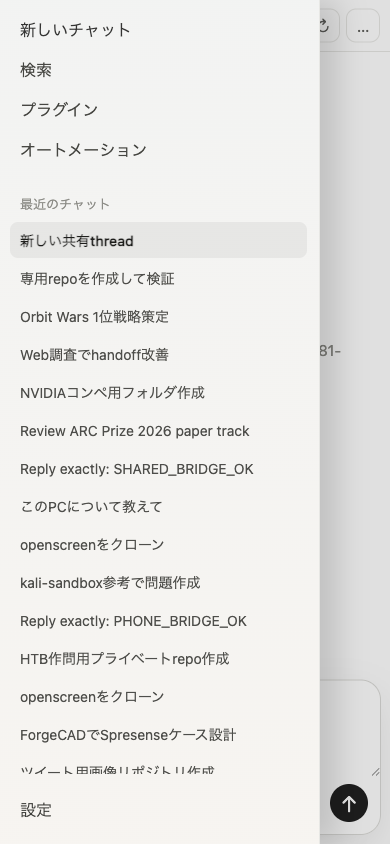

Button behavior checks:

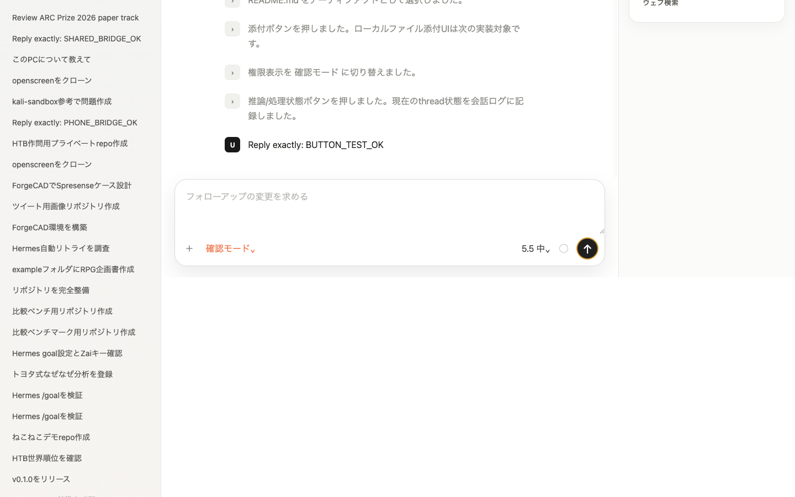

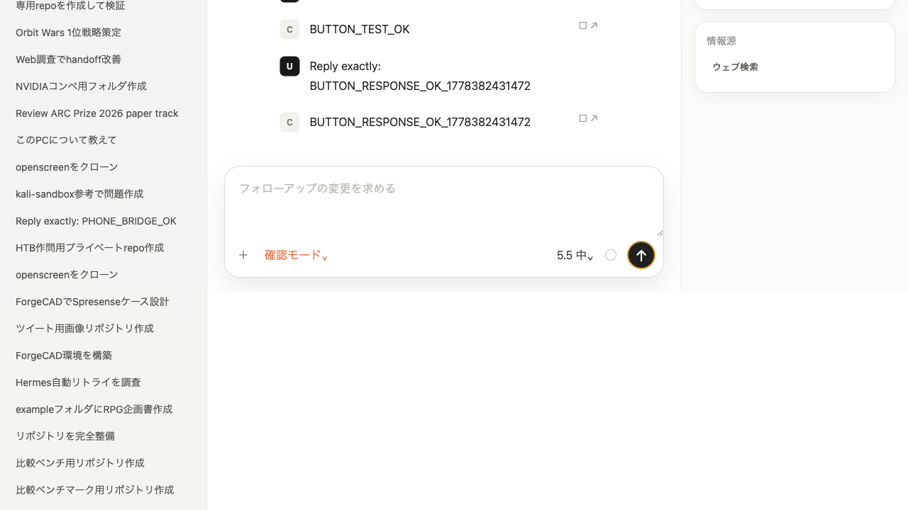

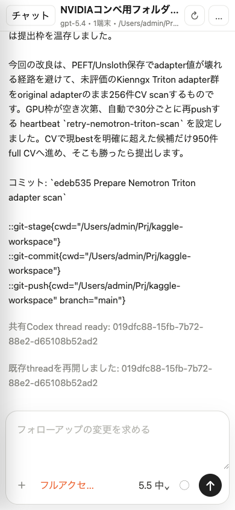

Expanded Desktop-like controls:

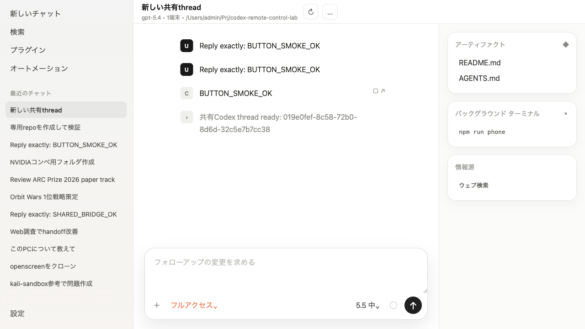

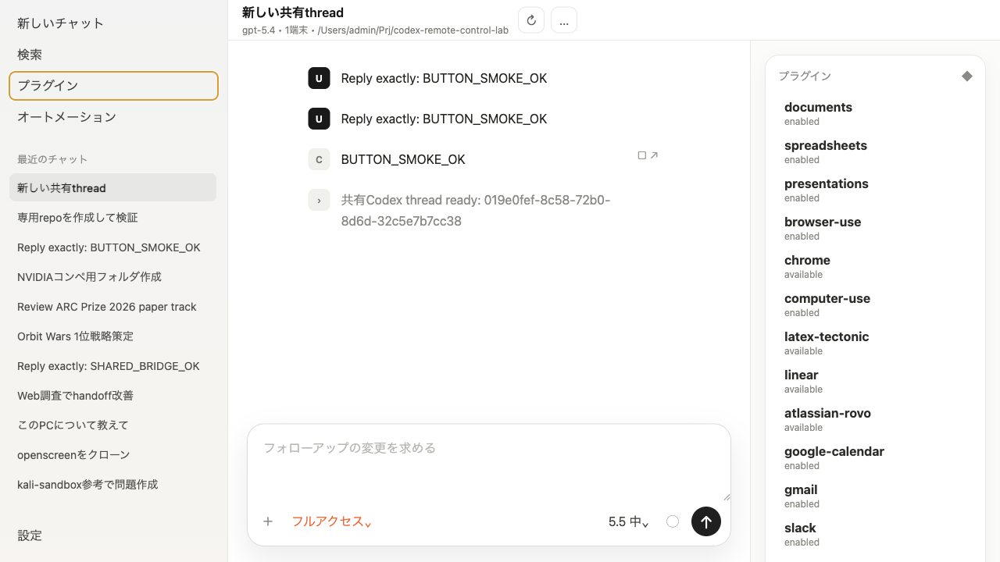

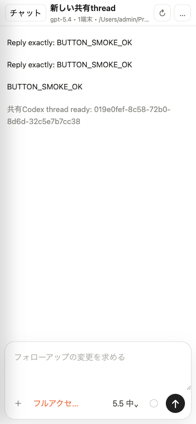

Markdown preview checks:

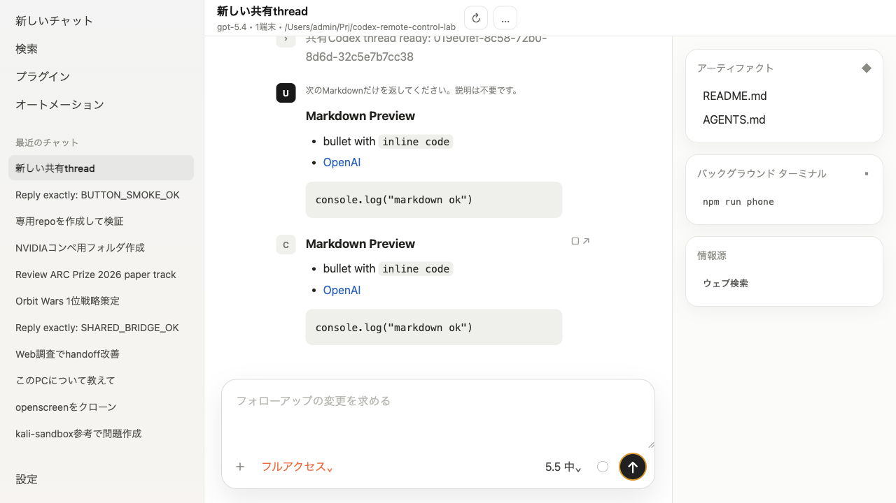

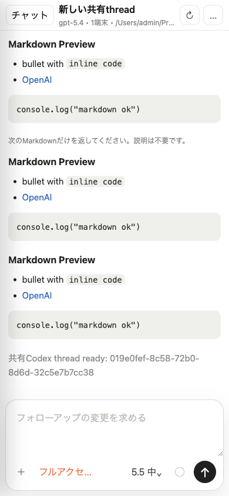

Artifact Markdown preview:


Collapsed status log checks:

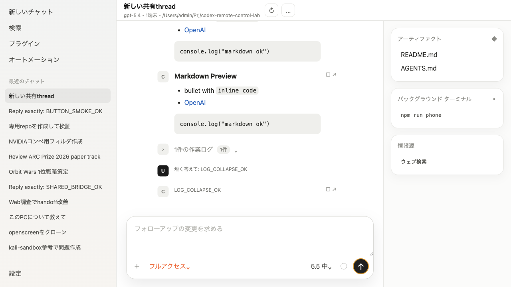

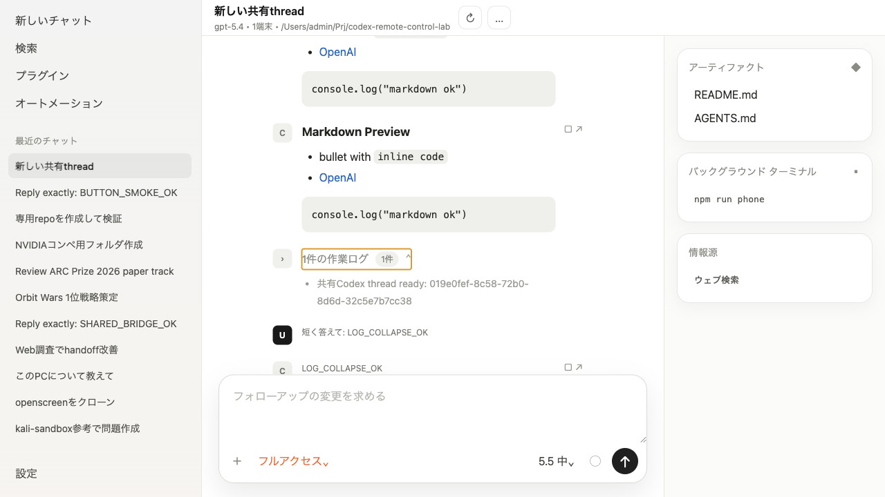

Image preview checks:

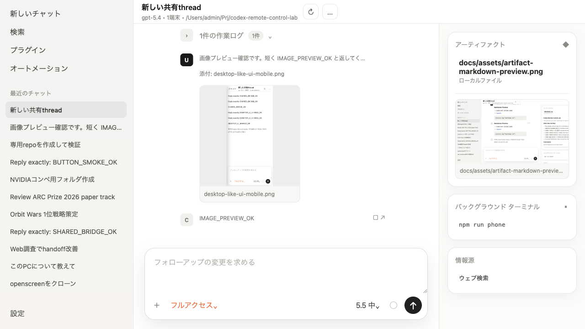

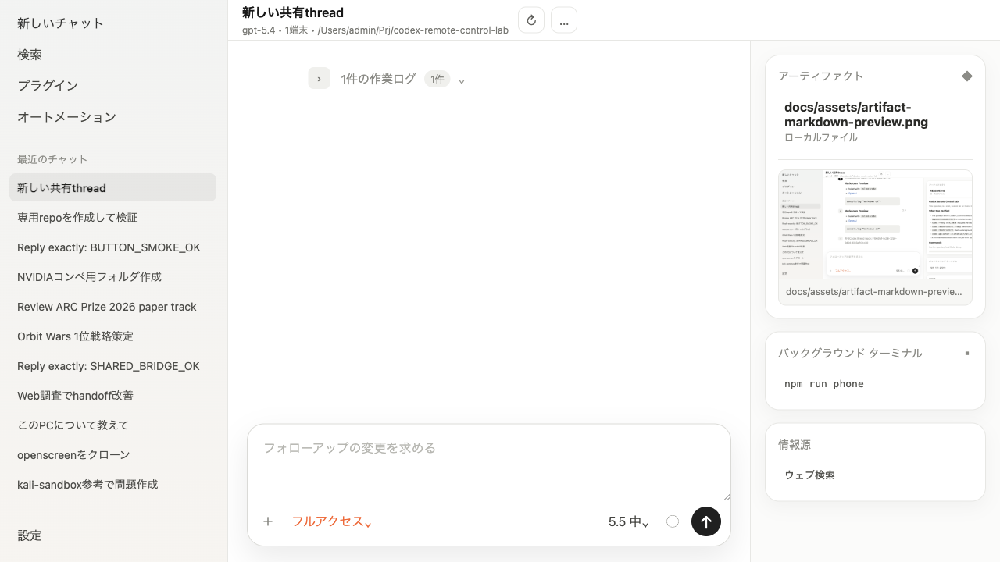

Compact chat typography with image-link preview:


## Observed WebSocket Behavior

The health probes returned:

- `GET /readyz`: `200 OK`
- `GET /healthz`: `200 OK`
- `GET /healthz` with an `Origin` header: `403 Forbidden`

The probe script received:

- an `initialize` result containing `cliVersion`-equivalent user agent data for `0.130.0`
- `remoteControl/status/changed` with `status: "disabled"` for the plain WebSocket app-server
- a successful `thread/start` response with a new thread id and `cwd` set to this repository

## Safety Notes

The WebSocket listener should stay on `127.0.0.1` unless authentication and a private network path are configured. For another machine, prefer SSH port forwarding or a VPN/mesh network rather than binding an unauthenticated listener to a public interface.

## Sources Checked

- OpenAI Codex app-server docs: https://developers.openai.com/codex/app-server
- OpenAI Codex remote connections docs: https://developers.openai.com/codex/remote-connections
- Codex `0.130.0` release: https://github.com/openai/codex/releases/tag/rust-v0.130.0
- `remote-control` PR: https://github.com/openai/codex/pull/21424
