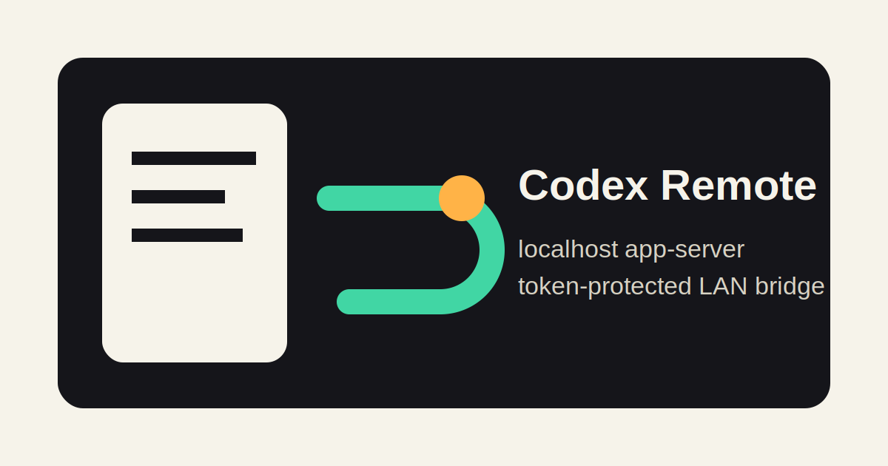

<p align="center">
  
</p>

<p align="center">
  <a href="README.ja.md">日本語</a> ·
  <a href="https://sunwood-ai-labs.github.io/codex-remote-control-lab/">Docs</a> ·
  <a href="https://github.com/Sunwood-ai-labs/codex-remote-control-lab">GitHub</a>
</p>

<p align="center">
  
  
  
  
</p>

# Codex Remote Control Lab

Codex Remote Control Lab turns your phone into a remote control for the Codex session running on your desktop. Start the bridge on the Mac, open the tokenized URL from a phone, and continue the same Codex thread from either device.

It is a local-first experiment for OpenAI Codex CLI `remote-control` and `app-server` workflows. It keeps the Codex app-server on `127.0.0.1`, then exposes only a small token-protected browser bridge to devices on the same LAN.

## ✨ What It Does

- starts a repository-local Codex CLI `0.130.0` app-server
- lets a phone browser operate the desktop Codex app-server without exposing that app-server directly to the LAN
- syncs one active Codex thread between desktop and phone, so you can start on the PC, step away, and keep working from mobile
- serves a phone-friendly browser UI with thread resume, artifact preview, approvals, model selection, image attachments, and selectable color themes
- shares one bridge-managed Codex thread across a phone and desktop browser
- keeps `.phone-token`, `.uploads/`, `.codex-home*/`, logs, and session databases out of Git
- publishes bilingual docs through VitePress and GitHub Pages

## 🚀 Quick Start

```bash
git clone https://github.com/Sunwood-ai-labs/codex-remote-control-lab.git
cd codex-remote-control-lab
npm ci
npm run phone
```

The command prints a URL like this:

```text
http://192.168.11.8:45214/?token=...
```

Open that exact URL from a phone connected to the same Wi-Fi/LAN.

## 🧭 Architecture

```text
phone browser -> http://Mac-LAN-IP:45214 -> Node bridge -> ws://127.0.0.1:45213 -> Codex app-server
```

The safer boundary is intentional: Codex's app-server remains bound to localhost; only the small token-protected bridge is reachable from the LAN.

## 🧪 Verification Commands

```bash
npm run check
npm run docs:build
npm audit --omit=dev
```

Protocol-only smoke test:

```bash
npm run server:ws
npm run probe:ws
```

The local smoke test verified `initialize` and `thread/start` through the WebSocket app-server, plus `/readyz` and `/healthz` behavior.

## 📱 Phone Bridge

The main value of the bridge is continuity: the desktop keeps running Codex locally, while the phone becomes a LAN remote for that same session. The bridge-managed thread can be opened from both the PC browser and the phone browser, making the workflow feel synced instead of split across devices.

Useful environment variables:

```bash
PHONE_UI_PORT=45214 npm run phone
CODEX_WORKDIR=/Users/admin/Prj/some-project npm run phone
CODEX_MODEL=gpt-5.4 npm run phone
CODEX_APP_SERVER_SOCK=/Users/admin/.codex/app-server-control/app-server-control.sock npm run phone
CODEX_APP_SERVER_URL=ws://127.0.0.1:45213 npm run phone
CODEX_HISTORY_SYNC=0 npm run phone
PHONE_TOKEN=choose-your-own-token npm run phone
PHONE_NTFY_TOPIC=your-private-topic npm run phone
PHONE_PUSHOVER_TOKEN=app-token PHONE_PUSHOVER_USER=user-key npm run phone
PHONE_DISCORD_WEBHOOK_URL=https://discord.com/api/webhooks/... npm run phone
PHONE_NOTIFY_TIMEOUT_MS=5000 npm run phone
```

`CODEX_APP_SERVER_SOCK` or `CODEX_APP_SERVER_URL` makes the bridge attach to an existing headless app-server instead of starting a new one. For live sync with Codex Desktop, use this with a Desktop Remote Connection that points at the same headless app-server. The normal local conversation view in Codex Desktop uses a private `stdio` app-server, so there is no public external route for a bridge to inject live UI updates into that local view.

History sync is enabled by default. After a web turn completes, the bridge warms the app-server history with `thread/read` and a scan-backed `thread/list`, and `/api/threads` also avoids state-DB-only listing. This helps Codex Desktop discover the updated session after reopening or refreshing the thread. It does not inject live updates into an already-open normal Desktop conversation view. Set `CODEX_HISTORY_SYNC=0` to disable the extra history refresh calls.

Startup notifications are opt-in. `PHONE_NTFY_TOPIC` sends the bridge URLs to an ntfy topic, `PHONE_PUSHOVER_TOKEN` plus `PHONE_PUSHOVER_USER` sends them through Pushover, and `PHONE_DISCORD_WEBHOOK_URL` posts them to Discord. `npm run phone` loads local `.env` values before reading these variables. `PHONE_NTFY_SERVER` defaults to `https://ntfy.sh` and must use HTTPS. The notification body includes the tokenized bridge URL, so use a private/protected topic, account, or channel and keep these values in local environment variables.

The current phone bridge supports:

- Codex Desktop-like browser layout with a left thread sidebar, central conversation, right artifact panel, and bottom composer
- recent thread listing and direct thread resume
- default history-sync refresh for Desktop reopen/refresh continuity
- plugin, model, config/auth, and automation status panels
- approval and sandbox mode controls for the next turn
- Markdown rendering in chat and artifact previews
- Markdown image links rendered inline where possible
- browser-selected image attachments sent as Codex `localImage` inputs
- local repository image artifacts served through token-protected file routes
- collapsed status/tool logs with expandable detail rows
- simple, cyberpunk, and botanical color themes saved in browser local storage

## 🖼️ UI Evidence

Desktop-like layout:


Mobile layout:


Compact chat typography with image-link preview:


Mobile responsive chat check:


Mobile responsive drawer check:


Theme selector on mobile:


Codex Desktop-like mobile composer controls:


Model and intelligence menu on mobile:


More screenshots are available in `docs/assets/` and through the artifact panel in the bridge UI.

## 🔐 Safety Notes

- Keep the Codex app-server on `127.0.0.1`.
- Do not bind an unauthenticated Codex app-server to a LAN or public interface.
- Use SSH forwarding, a VPN, or a mesh network for access outside a trusted LAN.
- Delete `.phone-token` or set a new `PHONE_TOKEN` after demos on shared networks.

See [SECURITY.md](SECURITY.md) for the public-safe checklist.

## 📚 Documentation

- [English docs](https://sunwood-ai-labs.github.io/codex-remote-control-lab/)
- [日本語ドキュメント](https://sunwood-ai-labs.github.io/codex-remote-control-lab/ja/)
- [v0.2.0 release notes](https://sunwood-ai-labs.github.io/codex-remote-control-lab/guide/releases/v0.2.0)
- [Phone bridge guide](docs/guide/phone-bridge.md)
- [Protocol notes](docs/guide/protocol.md)
- [Security model](docs/guide/security.md)

## 🗂️ Repository Layout

```text
public/              Browser UI served by the phone bridge
scripts/             Codex app-server probe and bridge launcher
docs/                VitePress docs and screenshot assets
docs/assets/         UI verification screenshots
docs/public/         Docs/README identity assets
.github/workflows/   CI and GitHub Pages deployment
```

## 📄 License

ISC. See [LICENSE](LICENSE).
