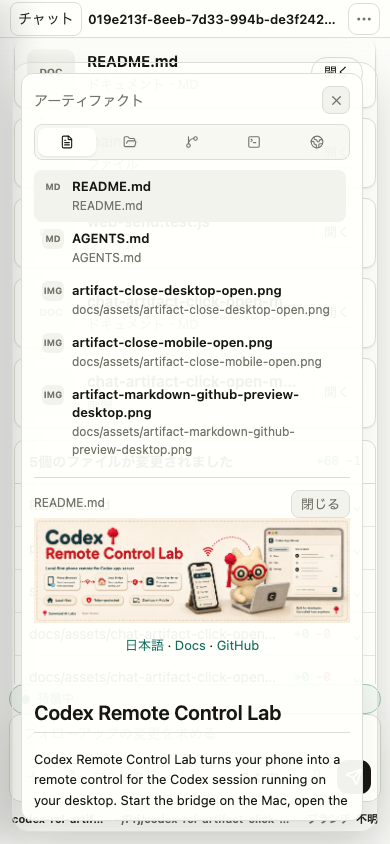
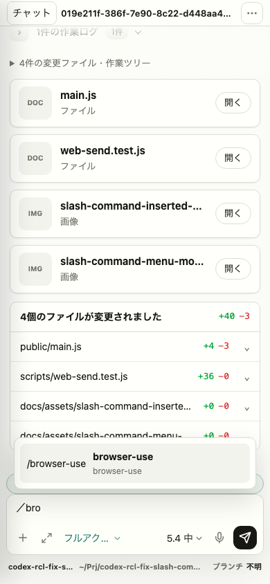

# v0.4.0 Mobile Reliability Walkthrough

v0.4.0 is a reliability release for the moments when the bridge is actually used from a phone: opening the right artifact, typing slash commands with a mobile keyboard, avoiding iOS focus zoom, and understanding whether a run is reconnecting, waiting for approval, or ready to interrupt.

## Mobile Taps Need To Be Precise

The artifact panel is one of the bridge's most important phone workflows. v0.4.0 hardens the path from chat and review digest cards into the artifact preview. The click handling now resolves the nearest artifact trigger even when the tap lands on nested text, keeps the panel open on narrow screens, and preserves the artifact selected from the chat card instead of falling back to the first row in the panel.

The proof assets added in this release show the mobile artifact click path and the final open state:

## Slash Skills From A Phone Keyboard

The composer can now open an installed skill menu when the operator types a slash command. The bridge reads actual installed plugin `SKILL.md` files where available, filters the menu as the operator types, retries after a temporary `/api/skills` failure, and normalizes full-width mobile slash input before inserting the selected command.

That matters on phones because the keyboard and IME often produce slightly different input than a desktop keyboard. The release adds Playwright coverage for normal slash input, retry, and full-width slash insertion, plus screenshot evidence for both the menu and inserted command states.

## Keeping The Conversation Readable

The bridge now treats reconnecting streams and background thread polling as status problems rather than chat content problems. A reconnect-style Codex payload updates the run state without showing raw transport details in the conversation, and repeated thread-list failures after a disconnect stay quiet.

Thread switching also becomes calmer. The previous visible history remains in place while the selected thread loads, and stale ready messages from earlier WebSocket connections are ignored. The effect is simple: the phone UI stops jumping backward when the network is a little messy.

## Provider And Status Awareness

v0.4.0 adds `npm run phone:claude` for the experimental Claude provider. It uses the same browser bridge UI, starts per-turn `claude -p --output-format stream-json` processes, and reads same-workdir Claude Code JSONL sessions for the sidebar. Codex-only app-server features remain scoped to Codex mode, so the docs avoid claiming parity where the implementation does not provide it.

Codex mode can also show optional rate-limit status through `PHONE_CODEX_RATE_LIMIT_REFRESH_COMMAND="node scripts/read-desktop-rate-limits.js"`. The helper reads local Codex auth, calls the usage endpoint, normalizes display fields, and leaves raw tokens or full API responses out of the bridge cache.

## Safety And Release Hygiene

This release also cleans the public release surface. Generated `tmp/` campaign and QA artifacts are no longer tracked, local `.phone-rate-limits.json` and `.phone-workspaces.json` caches are ignored, and contributor docs now describe the public-safe path for upstream pull requests.

The release branch was checked with the Node test suite, the generated UI freshness and syntax check, VitePress build, CI `verify`, whitespace diff validation, and SVG XML validation for the release header.
