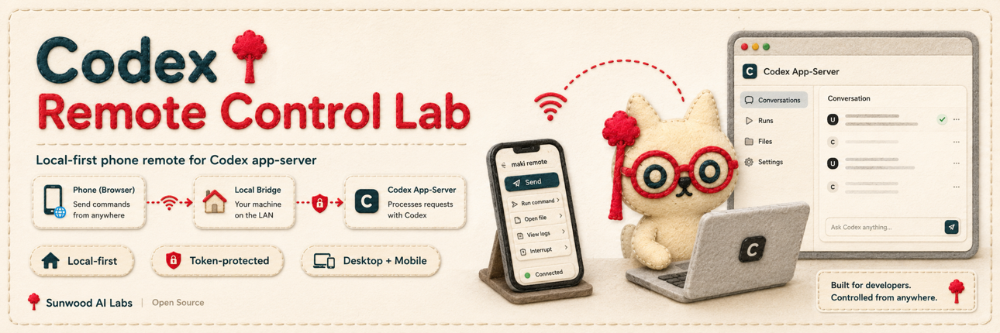

<p align="center">
  
</p>

## Quick Start

```bash
npm ci
npm run phone
```

Mac に表示された URL を、同じ Wi-Fi/LAN 上のスマホや別ブラウザで開きます。スマホからデスクトップの Codex セッションを操作でき、別ブラウザでも同じ bridge-managed thread を resume できます。

既定では page、API、WebSocket に token が必要です。host だけで UI を確認する場合は `PHONE_DEBUG_NO_TOKEN=1 npm run phone` を使うと、bridge は `127.0.0.1` に bind され、token なし URL を表示します。信頼できる private LAN に token なしで出す場合だけ、`PHONE_DEBUG_BIND=lan` を追加します。

protocol だけを確認する場合は、別 terminal で app-server と probe を動かします。

```bash
npm run server:ws
npm run probe:ws
```
