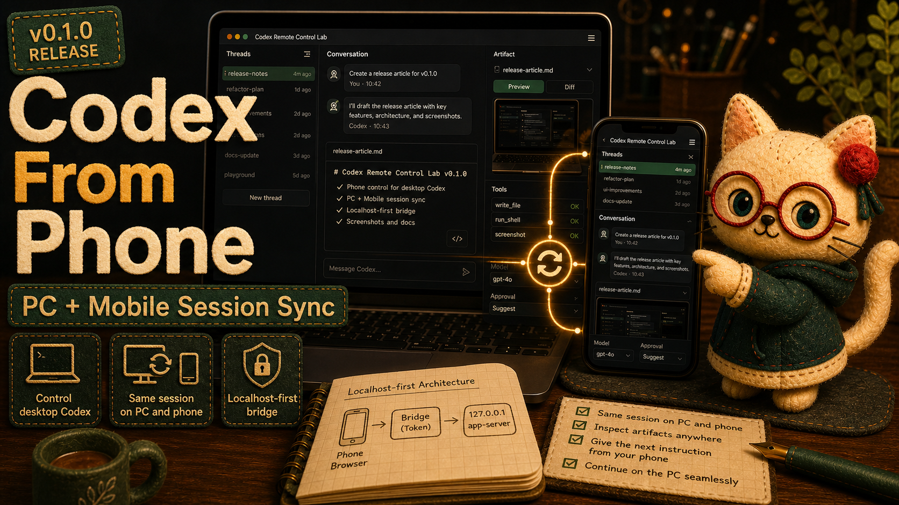

# Codex Remote Control Lab v0.1.0: control desktop Codex from your phone, with sessions synced across PC and mobile



Codex Remote Control Lab v0.1.0 is the first public release of a local-first experiment for OpenAI Codex CLI `remote-control` and `app-server` workflows.

The biggest idea is not just “a phone UI.” It is this:

**You can operate the desktop-side Codex session from your phone.**

And because the bridge can share one managed thread across browsers, your PC and phone can stay on the same Codex session. Start a task at your desk, check the artifact panel from your phone, send a follow-up instruction while away from the keyboard, then return to the PC and continue from the same session. That PC/mobile session sync is the point.


## One Codex session, two screens

Codex Remote Control Lab keeps the actual Codex app-server local, then exposes a token-protected browser bridge for trusted same-LAN devices.

On mobile, the browser UI gives you access to the same working surfaces you expect on desktop: threads, conversation, artifacts, model selection, approval controls, sandbox mode controls, and image attachments.


The bridge-managed thread is the important part. A phone browser and a desktop browser can look at the same session instead of creating two disconnected conversations.

That means you can:

- start a coding or documentation task on the PC
- monitor progress from your phone
- inspect artifacts without staying at the desk
- send the next instruction from mobile
- return to the PC and keep working from the same thread

It feels less like a separate mobile app and more like a synchronized remote control for the desktop Codex workflow.

## Localhost-first by design

The network boundary is intentional:

```text
phone browser -> http://Mac-LAN-IP:45214 -> Node bridge -> ws://127.0.0.1:45213 -> Codex app-server
```

The Codex app-server remains bound to `127.0.0.1`. The LAN-facing surface is the Node bridge, and that bridge requires a token on page, API, upload, artifact, and WebSocket paths.

So the app-server itself is not treated as a LAN service. Only the small browser bridge is exposed.

## What shipped in v0.1.0

This initial release packages a working bridge, browser UI, public documentation, screenshot evidence, and validation workflow.

Highlights:

- repository-local Codex CLI `0.130.0` app-server launcher
- token-protected phone bridge for same-LAN browser clients
- one bridge-managed thread shared across phone and desktop browsers
- recent thread resume
- artifact preview
- approval and sandbox mode controls for the next turn
- model selection
- image attachments sent to Codex as `localImage` inputs
- Markdown rendering in chat and artifact previews
- grouped project/thread navigation
- collapsed status and tool logs
- simple, cyberpunk, and botanical color themes
- bilingual docs through VitePress and GitHub Pages

## A readable mobile workspace

v0.1.0 keeps the dense desktop-style layout while making the right panel, settings, and responsive states usable on phone-sized screens. The selected theme is saved in browser local storage, so you can switch between simple, cyberpunk, and botanical appearances.


Markdown artifacts and image previews are also part of the workflow, so release notes, generated reports, screenshots, and local repository artifacts can be reviewed from either screen.


## Validation

The release was checked with:

```bash
npm run check
npm audit --omit=dev
npm run docs:build
xmllint --noout docs/public/logo.svg docs/public/social-card.svg
```

I also smoke-tested the running bridge with a test token and confirmed the settings panel showed the three themes. Switching to Cyberpunk set `html[data-theme="cyberpunk"]`.

GitHub Actions CI and the docs deployment completed successfully for the release commit, and the live documentation returned HTTP 200.

## Links

- GitHub repository: https://github.com/Sunwood-ai-labs/codex-remote-control-lab
- v0.1.0 release: https://github.com/Sunwood-ai-labs/codex-remote-control-lab/releases/tag/v0.1.0
- Documentation: https://sunwood-ai-labs.github.io/codex-remote-control-lab/
- Phone bridge guide: https://sunwood-ai-labs.github.io/codex-remote-control-lab/guide/phone-bridge
- Japanese documentation: https://sunwood-ai-labs.github.io/codex-remote-control-lab/ja/
