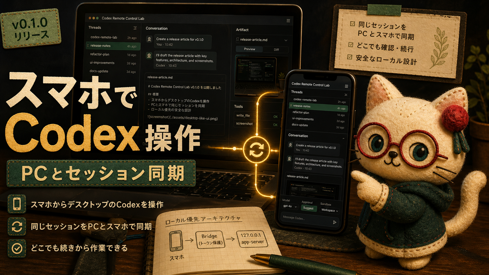

# Codex Remote Control Lab v0.1.0 を公開しました: スマホからデスクトップのCodexを操作して、PCとスマホでセッション同期できる実験場



Codex Remote Control Lab v0.1.0 を公開しました。OpenAI Codex CLI の `remote-control` / `app-server` を、ローカル優先で安全に試すための実験リポジトリです。

このリリースでいちばん大きいポイントは、**スマホからデスクトップ側のCodexを操作できること**です。

しかも単なるリモコンではありません。PCブラウザとスマホブラウザで同じ bridge-managed thread を共有できるので、**PCとスマホでCodexセッションを同期できます**。デスクではPCで続きを見て、席を離れたらスマホで同じセッションを確認して、そのまま次の指示を出せます。ここがかなり大きいです。


## PCとスマホで同じCodexセッションを扱う

Codex Remote Control Lab は、Mac上の Codex app-server を直接LANへ出すのではなく、token-protected bridge を通してブラウザUIを提供します。

スマホから開くと、PCと同じように thread、conversation、artifact、model、approval/sandbox control を扱えます。


共有できるのは画面だけではありません。bridge-managed thread を使うことで、PCブラウザとスマホブラウザが同じセッションの続きを見られます。

たとえば:

- PCで長めの実装作業を始める
- スマホで進捗やartifactを確認する
- スマホから追加指示を送る
- 戻ってきたらPC側で同じセッションの続きを見る

この流れを、追加のクラウドサービスを挟まずローカル優先で試せるようにしたのが v0.1.0 です。

## localhost-first の安全境界

構成は次のようにしています。

```text
phone browser -> http://Mac-LAN-IP:45214 -> Node bridge -> ws://127.0.0.1:45213 -> Codex app-server
```

Codex app-server は `127.0.0.1` に残します。LAN に出るのは Node bridge だけで、page / API / upload / artifact / WebSocket path には token を要求します。

つまり、Codex app-server 自体をLANサービスとして公開するのではなく、操作面だけを小さなbridgeで橋渡しします。

## v0.1.0 で入っているもの

今回の初回リリースでは、bridge 本体、ブラウザ UI、公開ドキュメント、スクリーンショット証跡、検証フローをまとめました。

主な内容:

- repo-local の Codex CLI `0.130.0` app-server 起動
- 同一 LAN のブラウザ向け token-protected phone bridge
- phone と desktop browser で 1 つの bridge-managed thread を共有
- 最近の thread 一覧と resume
- artifact preview
- 次 turn 向けの approval / sandbox mode control
- model 選択
- 画像添付を Codex `localImage` input として送信
- chat と artifact preview の Markdown rendering
- project / thread の grouped navigation
- status / tool log の折りたたみ表示
- simple / cyberpunk / botanical のカラーテーマ
- VitePress と GitHub Pages による日英 docs

## スマホでも読みやすい操作画面

v0.1.0 では、デスクトップ風の情報密度を保ちながら、スマホでも操作しやすいように右パネルや設定画面を調整しています。テーマは browser local storage に保存されるので、simple / cyberpunk / botanical を環境に合わせて切り替えられます。


また、Markdown artifact や画像previewも、PC/スマホ両方から確認できるようにしています。


## 検証

リリース前に次を確認しました。

```bash
npm run check
npm audit --omit=dev
npm run docs:build
xmllint --noout docs/public/logo.svg docs/public/social-card.svg
```

さらに test token で bridge を起動し、設定panelに3つのテーマが表示されること、Cyberpunkに切り替えると `html[data-theme="cyberpunk"]` になることを確認しています。

GitHub Actions の CI と docs deploy も release commit で成功し、公開 docs も HTTP 200 を返すことを確認しました。

## リンク

- GitHub repository: https://github.com/Sunwood-ai-labs/codex-remote-control-lab
- v0.1.0 release: https://github.com/Sunwood-ai-labs/codex-remote-control-lab/releases/tag/v0.1.0
- Documentation: https://sunwood-ai-labs.github.io/codex-remote-control-lab/
- Phone bridge guide: https://sunwood-ai-labs.github.io/codex-remote-control-lab/guide/phone-bridge
- 日本語ドキュメント: https://sunwood-ai-labs.github.io/codex-remote-control-lab/ja/
